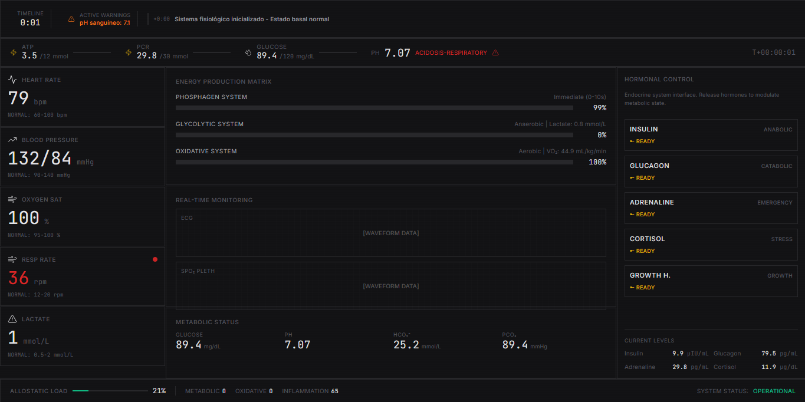

# Homeostasis — simulador de fisiologia

Simulação biomédica educativa que conecta sinais sistêmicos, microcirculação, metabolismo celular e decisões de manutenção da homeostase em uma interface clínica inspirada em Frostpunk.



> O simulador é um modelo educacional e de gameplay. Ele não é um dispositivo médico, não representa um paciente individual e não deve orientar diagnóstico ou tratamento.

## Conceito

O jogador não altera diretamente pH, osmolaridade, perfusão ou concentração de ATP. Ele aplica intervenções — como ingestão de água, comando cronotrópico, drive ventilatório, reabsorção renal e liberação hormonal — e observa as respostas com atraso fisiológico.

O painel principal acompanha o organismo como um todo. O botão discreto **MICROVISTA**, na barra superior, troca a área central por um voxel de tecido metabolicamente ativo sem interromper a timeline, os marcadores sistêmicos ou o loop da simulação.

## MICROVISTA

A MICROVISTA possui três escalas complementares:

- **TECIDO:** microcirculação, perfusão, líquido extracelular (LEC), entrega capilar de substratos e remoção de resíduos.
- **INTRACELULAR:** líquido intracelular (LIC), volume celular, pH, Na⁺, K⁺, Ca²⁺, potencial de membrana, ATP/ADP e viabilidade.
- **MAQUINARIA:** glicólise, piruvato, beta-oxidação, cadeia transportadora de elétrons, ATP sintase, espécies reativas de oxigênio e reparo.

As abas aceitam clique e navegação por teclado. `Esc` ou **VOLTAR AO PAINEL** fecha a MICROVISTA.

### Ciclo de gameplay celular

1. **Captar:** clique em glicose, O₂, ácido graxo ou aminoácido para transferir um pacote disponível do LEC ao LIC.
2. **Executar glicólise:** consuma glicose captada para formar piruvato, ATP citosólico e equivalentes redutores.
3. **Oxidar:** envie piruvato ou ácido graxo, junto com O₂, para a mitocôndria. ADP + Pi e o gradiente de H⁺ permitem que a ATP sintase produza ATP.
4. **Alocar ATP:** preserve bombas iônicas e use energia para reparar membrana, proteínas, DNA ou recuperar a capacidade antioxidante.
5. **Automatizar:** invista ATP em transportadores, navette mitocondrial e maquinaria de reparo, cada uma com três níveis.
6. **Responder à rotina:** contração local, renovação proteica, sinal inflamatório e carga osmótica alteram demanda, lactato e pressão oxidativa.

ATP não é levado para dentro da mitocôndria por vesículas. No modelo, substratos, O₂ e ADP/Pi alimentam a fosforilação oxidativa; o ATP produzido é então destinado aos consumidores celulares.

Os pools clicáveis são **pacotes normalizados de gameplay**. Valores exibidos como pH, mmHg, mmol/L, mOsm/kg, mV e nM representam grandezas fisiológicas; a quantidade de pacotes não equivale diretamente a mols ou moléculas. Consulte [Modelo fisiológico e limites](docs/PHYSIOLOGY_MODEL.md).

## Intervenções disponíveis

Na lateral da MICROVISTA:

- **Ingestão hídrica:** doses de 250 ou 500 mL entram em um reservatório gastrointestinal e são absorvidas gradualmente, até 16 mL/min.
- **Alvo cronotrópico:** 45–180 bpm. É um comando autonômico/pacing simulado; a frequência observada responde progressivamente e também depende de exercício, estresse, catecolaminas e volume circulante.
- **Drive ventilatório:** 50–180%. Modifica frequência e volume corrente; PaCO₂, PaO₂, SpO₂ e pH respondem ao balanço entre ventilação alveolar e metabolismo.
- **Reabsorção renal de água:** 98,5–99,8%. Altera o fluxo urinário, a água corporal e, por diluição ou concentração, o Na⁺ plasmático e a osmolaridade tecidual.

O painel sistêmico mantém os controles hormonais de insulina, glucagon, adrenalina, cortisol e GH, com duração, clearance, custo energético e cooldown.

## Sistemas modelados

### Energia sistêmica

- Sistema oxidativo como fonte predominante em repouso.
- ATP-PCr como tampão de transientes rápidos de demanda.
- Glicólise para demanda residual, com produção e clearance de lactato.
- Regeneração dos pools de ATP e fosfocreatina quando há reserva aeróbia.
- RER, VO₂, VCO₂, déficit energético e uso de substratos.

### Transporte e compartimentos

- Sangue arterial → microcirculação → LEC → LIC.
- Perfusão derivada de débito cardíaco e pressão arterial média.
- PO₂/PCO₂ teciduais, glicose, lactato, pH, osmolaridade, Na⁺, K⁺ e resíduos.
- Gradientes intracelulares, bombas dependentes de ATP, volume e potencial de membrana.

### Controle sistêmico

- Frequência cardíaca, volume sistólico, débito cardíaco, resistência vascular e pressão arterial.
- Frequência respiratória, volume corrente, ventilação alveolar, PaO₂, PaCO₂ e SpO₂.
- Equilíbrio ácido-base, bicarbonato, excesso de base e ânion gap aproximado.
- Glicemia, glicogênio, ácidos graxos, hidratação e eletrólitos.
- Hormônios com retorno ao basal e dose distribuída no tempo.
- Carga alostática, dano e recuperação de órgãos.

### Dano e manutenção celular

- ROS aumentam com fluxo mitocondrial, hiperglicemia, hipóxia, pressão redox e eventos inflamatórios.
- Baixo ATP compromete bombas iônicas, gradientes e potencial de membrana.
- Hipóxia, acidose, estresse osmótico e ROS lesionam membrana, proteínas e DNA.
- ATP alocado ao reparo reduz dano; antioxidantes reduzem pressão oxidativa.
- Viabilidade combina dano acumulado com penalidades agudas por ATP e pH.

## Equações principais

```text
pH = 6.1 + log10([HCO₃⁻] / (0.03 × PaCO₂))

Débito cardíaco (L/min) = FC (bpm) × volume sistólico (mL) / 1000

PAM = PAD + (PAS - PAD) / 3

RER = VCO₂ / VO₂

PAO₂ ≈ FiO₂ × (Patm - PH₂O) - PaCO₂ / R

Osmolaridade LEC aproximada = 2 × [Na⁺] + glicose/18 + 5
```

As equações completas, constantes, faixas e normalizações estão documentadas em [docs/PHYSIOLOGY_MODEL.md](docs/PHYSIOLOGY_MODEL.md).

## Interface

A aplicação preserva uma linguagem visual única:

- painéis escuros, bordas finas e grade densa;
- tipografia monoespaçada e números tabulares;
- cores reservadas a dados e estados fisiológicos;
- alertas com texto, ícone e cor;
- visualizações SVG leves, sem transformar a microscopia em uma interface separada do painel clínico;
- abas semânticas, foco visível e alternativa por clique para ações que também aceitam arrastar e soltar.

## Tecnologias

- React 18 + TypeScript
- Zustand
- Tailwind CSS
- Lucide React
- Vite

## Executar localmente

Requer Node.js e npm.

```bash
npm install
npm run dev
```

Validação e pré-visualização de produção:

```bash
npm run build
npm run preview
```

No Windows PowerShell, use `npm.cmd` se a política de execução bloquear `npm.ps1`.

## Estrutura atual

```text
src/
├── App.tsx
├── components/
│   ├── Dashboard/
│   │   └── FrostpunkDashboard.tsx    # Painel sistêmico e acesso à MICROVISTA
│   └── Cellular/
│       ├── CellularWorkbench.tsx     # Abas, métricas, controles e automação
│       ├── CellularViews.tsx         # Tecido, LIC e maquinaria celular
│       └── CellularPrimitives.tsx    # Painéis, métricas, barras e botões clínicos
└── game/
    ├── types.ts                      # Contratos do modelo sistêmico
    ├── physiology.ts                 # Estado basal
    ├── simulationLogic.ts            # Motor fisiológico macroscópico
    ├── cellularTypes.ts              # Contratos LEC/LIC/mitocôndria
    ├── cellularSimulation.ts         # Motor e ações celulares
    ├── simulationStore.ts            # Orquestração Zustand e intervenções
    └── actions.ts                    # Definições hormonais

docs/
└── PHYSIOLOGY_MODEL.md               # Fórmulas, unidades, acoplamentos e limites
```

## Nota educacional

O simulador é adequado para explorar relações de causa e efeito — por exemplo, como perfusão e ventilação condicionam a oferta de O₂, como ATP sustenta gradientes iônicos e como o metabolismo gera custo oxidativo. Os valores e alertas não substituem avaliação clínica, literatura de referência ou modelos multicompartimentais validados.

## Licença

MIT License.
