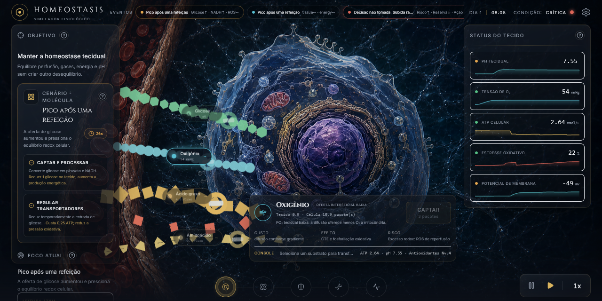

# Homeostasis

## Controle o tecido. Adapte-se às adversidades.

Um organismo vivo nunca está realmente parado. A glicose cai, o CO₂ se acumula, a pressão oscila, a temperatura sobe e uma resposta que protege agora pode causar dano alguns minutos depois.

Em **Homeostasis**, você assume o controle de um tecido integrado ao restante do corpo. Observe os sinais sistêmicos, interprete o que está acontecendo e coordene hormônios, regulação central, captação de substratos e metabolismo celular para manter a vida diante de diferentes desafios fisiológicos.

Cada evento interrompe a simulação e abre um período de análise. Você pode navegar entre tecido, célula, maquinaria e sistema antes de decidir. A intervenção correta favorece adaptação e recuperação; uma sinalização inadequada pode produzir hipoglicemia, alteração ventilatória, perda de perfusão, desequilíbrio hidroeletrolítico ou uma carga iatrogênica que continua agindo mesmo depois da decisão.

O objetivo não é encontrar um botão universalmente certo. É entender o contexto, preparar a resposta e sustentar a homeostase enquanto o organismo muda.

> O simulador é um modelo educacional e de gameplay. Não é um dispositivo médico e não deve orientar diagnóstico ou tratamento.



## A experiência

- início, pausa, velocidades `1x`, `2x` e `4x`, reinício e navegação por escalas;
- eventos fisiológicos apresentados na sidebar, com a simulação pausada para análise;
- leitura conjunta de sinais vitais, reservas sistêmicas, microambiente e estado celular;
- liberação hormonal e regulação central com efeitos, custos, riscos e tempo de ação;
- captação de glicose, oxigênio, ácidos graxos e aminoácidos pelo tecido;
- glicólise, oxidação de piruvato, beta-oxidação e automações celulares;
- reparo de membrana, proteínas, DNA e defesas antioxidantes;
- ingestão de água, alvo cardíaco, drive ventilatório e reabsorção renal;
- exercício, estresse, nutrição, sono, infecção, calor e alterações cardiorrespiratórias como contextos que exigem adaptação;
- consequências persistentes e graduais para atrasos ou intervenções inadequadas.

As quatro views — **Tecido**, **Intracelular**, **Maquinaria celular** e **Sistema** — compartilham o mesmo estado e continuam avançando na mesma timeline.

## Visão técnica para colaboradores

O projeto é um frontend React + TypeScript. O estado compartilhado fica no Zustand e o ciclo principal segue este fluxo:

```text
useSimulationLoop
  → simulationStore.tick
  → motor fisiológico sistêmico
  → motor celular
  → feedback célula–organismo
  → eventos, alertas, histórico e interface
```

Os módulos mais importantes para começar são:

- `src/game/simulationStore.ts`: timeline, comandos, decisões e integração dos motores;
- `src/game/simulationLogic.ts`: evolução macroscópica e sinais sistêmicos;
- `src/game/cellularSimulation.ts`: microambiente, metabolismo, reservas, dano e reparo celular;
- `src/game/scenarios.ts` e `scenarioResolution.ts`: eventos, requisitos e avaliação das decisões;
- `src/game/endocrine.ts`, `hypothalamus.ts` e `iatrogenic.ts`: sinalização hormonal, regulação central e consequências do uso inadequado;
- `src/components/Homeostasis/`: interface e visualizações; a lógica fisiológica deve permanecer nos módulos de domínio.

Ao adicionar uma intervenção, conecte seus efeitos às métricas sistêmicas e celulares, modele duração e feedback, e cubra os caminhos adaptativo e prejudicial com testes. Evite alterar números apenas na interface: o estado observado deve sempre derivar dos motores da simulação.

Fórmulas, unidades, faixas e limitações estão descritas em [docs/PHYSIOLOGY_MODEL.md](docs/PHYSIOLOGY_MODEL.md).
O stack de animação, as cenas 3D aplicadas e as próximas ferramentas recomendadas estão em [docs/VISUAL_GAMEPLAY_STACK.md](docs/VISUAL_GAMEPLAY_STACK.md).

## Tecnologias

- Vite + React 18 + TypeScript
- Three.js + React Three Fiber + Drei
- Zustand
- Tailwind CSS
- Lucide React

## Executar

```bash
npm install
npm run dev
```

No Windows PowerShell, use `npm.cmd` se a política de execução bloquear `npm.ps1`.

Validação de produção:

```bash
npm test
npm run lint
npm run build
```

## Estrutura

```text
src/
├── App.tsx
├── components/Homeostasis/  # única interface do simulador
└── game/                    # motores, cenários, sinalização, tipos e store

public/images/
└── cell-background.png
```

## Licença

Consulte [LICENSE](LICENSE).
