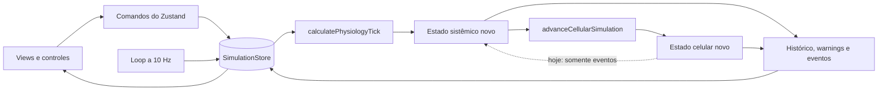

# Mapeamento técnico, fisiológico e de UX do Homeostasis

**Data da auditoria:** 31 de julho de 2026  
**Escopo:** arquitetura do código, gerenciamento de estado, motor sistêmico, motor celular, sinalização hormonal, contextos fisiológicos, capacidade de produzir alterações patológicas e experiência de uso.  
**Estado analisado:** árvore local do repositório; a alteração já existente em `package-lock.json` não faz parte desta auditoria.

> O simulador é educacional. Esta análise avalia coerência de software e plausibilidade fisiológica; não valida o produto para diagnóstico, prognóstico ou orientação terapêutica.

> **Estado de implementação em 1 de agosto de 2026:** este documento preserva o diagnóstico do snapshot auditado. As recomendações prioritárias já foram incorporadas ao runtime: configuração hormonal única, eixos endócrinos e efeitos downstream, perfis fisiopatológicos por capacidades, feedback micro → macro, testes de trajetória, cenários com contexto interno e decisão bloqueante, central flutuante Hormônios/Hipotálamo, remoção de controles fisiológicos diretos e da duplicidade Defesa/Genoma. A economia das decisões agora valida e consome recursos; saturação gera dano; a resolução soma evento, sinais, reservas e doença; e o destino celular inclui estresse, apoptose, necrose e suscetibilidade infecciosa. O estado vigente está descrito em [`PHYSIOLOGY_MODEL.md`](PHYSIOLOGY_MODEL.md).

## 1. Conclusão executiva

O projeto já tem uma base arquitetural coerente para um simulador educacional: há um estado basal explícito, dois motores numéricos separados, integração por `deltaTime`, compartimentos macro/tecido/célula, eventos, alertas, histórico e uma interface visual consistente. Ele está acima de um protótipo que apenas anima números.

Entretanto, o estado atual deve ser descrito como um **simulador causal simplificado de alterações fisiológicas agudas**, não como um simulador de fisiopatologia completa.

O motor consegue produzir relações plausíveis como:

- ventilação alveolar → PaCO₂ → pH;
- exercício → demanda de ATP → glicólise/lactato → carga fisiológica;
- débito e pressão → perfusão → oferta local de O₂ e substratos;
- água → diluição de sódio/osmolaridade → volume celular;
- ATP baixo/ROS/pH/osmolaridade → dano celular e perda de viabilidade;
- adrenalina → frequência cardíaca, resistência vascular, glicogenólise e lipólise;
- insulina/glucagon → deslocamento da glicemia e dos estoques de glicogênio.

Mas a resposta final ainda não é a soma fisiológica completa de “hormônio + contexto + tempo + estado do órgão”. Apenas insulina, glucagon, adrenalina e mTOR têm efeitos relevantes implementados. Sono não participa de nenhuma equação; cortisol, testosterona, T3, T4, TSH e noradrenalina podem mudar de concentração sem gerar a maior parte das consequências exibidas pela interface; e os cenários cotidianos surgem em uma sequência temporal fixa, independentemente do contexto que supostamente os causou.

Assim, hoje o sistema consegue induzir **alterações ou síndromes agudas de gameplay** — hipoglicemia, hiperglicemia, acidose/alcalose respiratória, hiper­lactatemia, taquicardia, arritmia, desidratação, dano celular e falência terminal por limiares. Ele ainda não induz de forma mecanística doenças como diabetes, sepse, insuficiência renal, hipertireoidismo ou síndrome de Cushing.

### Avaliação de maturidade

| Área | Maturidade atual | Diagnóstico |
|---|---|---|
| Identidade visual | Forte | Sistema glass escuro, dourado/ciano, fundo anatômico e componentes consistentes |
| Organização visual | Boa | Escalas Tecido → Mitocôndria → Defesa/Genoma → Sistema são compreensíveis |
| Arquitetura dos motores | Boa base | Motores puros e separados, mas com acoplamento somente macro → micro |
| Gerenciamento de estado | Funcional, em crescimento | Zustand atende, porém o store central reúne domínios demais e provoca assinaturas amplas |
| Fisiologia cardiorrespiratória aguda | Moderada | Relações úteis e determinísticas, ainda normalizadas e sem vários mecanismos clínicos |
| Metabolismo celular | Moderada para gameplay | Decisões bioquímicas coerentes, mas pacotes e rendimentos não conservam massa entre escalas |
| Endocrinologia | Baixa a parcial | Farmacocinética básica existe; eixos, feedback, receptores e vários efeitos não existem |
| Contextos fisiológicos | Parcial | Exercício e estresse têm efeito; nutrição é um proxy; sono não tem efeito |
| Fisiopatologia crônica | Baixa | Há desvios e falência por limiar, mas não estados de doença ou história natural |
| Cobertura de testes fisiológicos | Baixa | Há happy paths de ações, mas faltam invariantes, cenários sistêmicos e regressão numérica |

## 2. Mapa do repositório

| Área | Responsabilidade atual | Observações |
|---|---|---|
| [`src/components/Homeostasis/Simulator.tsx`](../src/components/Homeostasis/Simulator.tsx) | Shell da aplicação, loop, abas, overlays e navegação | Bom ponto para montar controles globais, como o dock hormonal |
| [`src/components/Homeostasis/navigation.tsx`](../src/components/Homeostasis/navigation.tsx) | Topbar, eventos, stepper e playback | Navegação de escala é local ao `Simulator` |
| [`src/components/Homeostasis/views.tsx`](../src/components/Homeostasis/views.tsx) | Tecido, intracelular, maquinaria e uma `SystemView` antiga | Concentra JSX muito denso; `SystemView` não é usada |
| [`src/components/Homeostasis/ClinicalSystemView.tsx`](../src/components/Homeostasis/ClinicalSystemView.tsx) | Tela sistêmica atualmente renderizada | Duplica parte da antiga `SystemView` |
| [`src/components/Homeostasis/ui.tsx`](../src/components/Homeostasis/ui.tsx) | Primitivos glass, métricas, progresso, ranges e ajuda | Boa base de design system local |
| [`src/game/simulationStore.ts`](../src/game/simulationStore.ts) | Estado Zustand, comandos, tick, histórico, eventos e loop | É simultaneamente store, application service e orquestrador |
| [`src/game/simulationLogic.ts`](../src/game/simulationLogic.ts) | Motor sistêmico determinístico | Contém energia, hormônios, nutrientes, cardio, respiração, ácido-base, órgãos e falência |
| [`src/game/cellularSimulation.ts`](../src/game/cellularSimulation.ts) | Motor de tecido/célula | Contém entrega, transporte, metabolismo, dano, reparo, cenários e recompensas |
| [`src/game/types.ts`](../src/game/types.ts) | Contratos sistêmicos | Unidades estão bem documentadas, mas misturam valores clínicos e normalizados |
| [`src/game/cellularTypes.ts`](../src/game/cellularTypes.ts) | Contratos celulares | Separa LEC, LIC, mitocôndria, pools, dano e automação |
| [`src/game/actions.ts`](../src/game/actions.ts) | Catálogo e segurança das ações hormonais | Não é a fonte única de dose, custo e cooldown |
| [`src/game/physiology.ts`](../src/game/physiology.ts) | Estado basal e helpers | Basal centralizado; helpers antropométricos ainda não parametrizam a simulação |
| [`docs/PHYSIOLOGY_MODEL.md`](PHYSIOLOGY_MODEL.md) | Descrição existente das equações | Boa intenção, mas já diverge do código em números importantes |

## 3. Arquitetura executada



### Ordem real do tick

1. `useSimulationLoop` solicita um tick em aproximadamente 10 Hz.
2. O store calcula o tempo real decorrido, aplica a velocidade e limita o passo sistêmico a 2 s.
3. Água pendente gera uma taxa de absorção gastrointestinal.
4. `calculatePhysiologyTick` produz o novo estado sistêmico.
5. `advanceCellularSimulation` recebe esse estado macro já atualizado.
6. O motor celular subdivide o passo em intervalos de até 0,25 s.
7. O store reduz cooldowns e duração das ações hormonais.
8. Histórico, eventos e warnings são substituídos/acumulados.
9. As views assinantes renderizam o novo snapshot.

Essa ordem é conceitualmente boa: evita a célula ler o estado macro anterior e reduz dependência do FPS. O problema principal é a direção única do acoplamento: dano, lactato, consumo e morte do voxel celular não alteram os órgãos ou pools sistêmicos. A célula pode estar em falência iminente enquanto o organismo continua vivo, porque o retorno é apenas textual, via evento.

## 4. Design da estrutura de código

### O que está bem resolvido

1. **Motores fora do React.** As equações não dependem da renderização, o que permite testes determinísticos e evolução do modelo.
2. **Tipos por domínio.** Cardio, respiração, ácido-base, hormônios, nutrientes, órgãos, tecido, LIC, mitocôndria e dano têm contratos identificáveis.
3. **Inicialização centralizada.** O adulto basal é criado por funções próprias, evitando valores espalhados pelas views.
4. **Separação macro/celular.** Mesmo incompleta, essa fronteira é melhor do que um único objeto sem escala biológica.
5. **Design system local.** `GlassPanel`, `ActionButton`, `RangeControl`, `MetricCard`, `ProgressBar` e `HelpTip` evitam reinventar o estilo em todos os painéis.
6. **Visualização ligada ao estado real.** Fluxos, coração, ECG, ETC e maquinaria consomem o estado do motor; não são animações totalmente desconectadas.

### Dívidas estruturais prioritárias

| Prioridade | Problema | Evidência | Impacto |
|---:|---|---|---|
| P0 | Metadados hormonais têm múltiplas fontes | `actions.ts` define custos/cooldowns; `simulationStore.ts` usa outros valores; o motor define outra tabela de meia-vida | UI, regra e documentação podem discordar sem erro de compilação |
| P0 | Existem controles que visualmente prometem efeitos inexistentes | `sleep` é editável, mas nunca lido pelo motor; vários hormônios só mudam no perfil | O jogador atribui causalidade a uma ação sem consequência |
| P0 | Documentação numérica já divergiu do runtime | Ver seção 11 | Dificulta validação e futuras calibrações |
| P1 | `simulationStore.ts` concentra estado, relógio, ingestão, hormônios, histórico, eventos, UI e loop | Quase mil linhas em um único módulo | Eleva acoplamento e custo de teste/manutenção |
| P1 | Há duas telas sistêmicas | `ClinicalSystemView` é usada; `SystemView` permanece exportada e sem consumidor | Duplica hormonal, contexto, alertas e intervenções |
| P1 | Assinaturas Zustand são amplas | Views assinam `physiology`, `cellular` e `history` inteiros | Quase qualquer tick renderiza grandes árvores de JSX e SVG |
| P1 | Bundle inicial concentra toda a experiência | O build gera um chunk JS minificado de aproximadamente 1,23 MB | A primeira carga paga por todas as cenas 3D; views/cenas são candidatas a `lazy`/chunks |
| P1 | O store usa `Map` em estado público | `hormonalCooldowns: Map<string, number>` | Dificulta serialização, persistência, replay e DevTools |
| P1 | Cenários estão misturados ao integrador celular | Textos, escolhas, custos e efeitos ficam no mesmo arquivo das equações | Dificulta testar, criar e versionar cenários independentemente |
| P2 | JSX excessivamente compactado | Especialmente `views.tsx` e trechos da tela clínica | Torna revisão visual e alterações seguras mais difíceis |
| P2 | Código legado permanece no runtime bundle | `SystemView` e parte do monitor cardíaco antigo | Aumenta superfície sem valor atual |

### Duplicação mais crítica: ações hormonais

O catálogo informa, por exemplo, cooldown de 120 s para insulina, 300 s para adrenalina e 14.400 s para T3. O store efetivamente aplica 30 s, 45 s e 120 s. Custos também divergem. Além disso, todas as ações são comprimidas para 18 s de infusão sustentada, mesmo quando a descrição diz “efeito lento por horas ou dias”.

A correção recomendada é uma única configuração tipada:

```ts
interface HormoneActionDefinition {
  id: string;
  hormone: keyof HormonalProfile;
  dose: number;
  bolusFraction: number;
  infusionSeconds: number;
  cooldownSeconds: number;
  metabolicCost: number;
  safetyRules: SafetyRuleId[];
  effectModel: HormoneEffectModelId;
}
```

Interface, store, motor, testes e documentação devem consumir o mesmo registro. A documentação de parâmetros pode ser gerada a partir dessa configuração.

## 5. Gerenciamento de estado

### Distribuição atual

| Estado | Dono atual | Avaliação |
|---|---|---|
| Macro fisiológico | Zustand | Correto para compartilhar entre todas as escalas |
| Estado celular | Zustand | Correto, pois continua evoluindo ao trocar de aba |
| Fatores externos | Zustand | Correto, mas dois controles são incompletos: sono é inerte e temperatura não tem setter na UI |
| Intervenções | Zustand | Correto como comando sustentado, embora FC e reabsorção sejam controles abstratos |
| Histórico | Zustand | Funciona, mas copia 25 arrays e faz manutenção manual de cada chave |
| Eventos/warnings | Zustand | Adequado para consumo global; reforços positivos podem gerar excesso de eventos |
| Cooldowns | `Map` no Zustand | Funciona em memória; ruim para serialização/replay |
| Aba, passo, overlay e `started` | estado local de `Simulator` | Boa escolha: é estado visual efêmero |

### Pontos fortes

- O snapshot macro e celular é atualizado em uma única operação final do tick.
- Ações celulares retornam um resultado estruturado com `ok`, estado, motivo e evento.
- Clonagem defensiva evita mutação direta do snapshot celular externo.
- Histórico tem limite de 200 pontos.
- O loop é cancelado corretamente ao desmontar.

### Pontos frágeis

1. **Não existe fila de comandos.** `releaseHormone`, `ingestWater` e `setVentilationDrive` podem alterar imediatamente partes do estado que o tick também controla. Isso enfraquece replay determinístico e auditoria causal.
2. **Resultados de ações são inconsistentes.** Ações celulares retornam sucesso; `releaseHormone` retorna `void`, então a UI depende de repetir a regra de segurança antes de chamar.
3. **A segurança hormonal é só uma barreira da view.** O store não chama `isActionSafe`; qualquer novo consumidor pode ignorar a regra.
4. **Seletores declarados não são os mais usados.** Existe um objeto `selectors`, mas as views assinam objetos completos. Como o tick substitui esses objetos, há renderização ampla em 10 Hz.
5. **Histórico é boilerplate e sujeito a omissão.** Um novo marcador exige editar interface, inicialização, cópia, `push` e truncamento.
6. **Não há versão de estado.** Persistência futura, saves ou cenários reproduzíveis precisarão de schema version e migrations.
7. **O relógio de gameplay e o relógio fisiológico são o mesmo.** O simulador comprime horas/dias em efeitos de segundos sem declarar uma escala temporal por mecanismo.

### Arquitetura alvo sem abandonar Zustand

Não é necessário trocar Zustand. O ganho maior vem de separar responsabilidades:

```text
src/game/
├── config/
│   ├── hormones.ts
│   ├── physiology.ts
│   └── clinicalRanges.ts
├── engines/
│   ├── systemic/
│   │   ├── cardiovascular.ts
│   │   ├── respiratory.ts
│   │   ├── acidBase.ts
│   │   ├── endocrine.ts
│   │   ├── renal.ts
│   │   └── metabolism.ts
│   ├── cellular/
│   └── stepSimulation.ts
├── scenarios/
│   ├── definitions.ts
│   ├── eligibility.ts
│   └── effects.ts
├── state/
│   ├── simulationSlice.ts
│   ├── interventionSlice.ts
│   ├── timelineSlice.ts
│   └── uiSlice.ts
└── tests/scenarios/
```

`stepSimulation(previous, commands, dt)` deve ser o único ponto que altera fisiologia. A UI enfileira comandos; o step consome comandos, aplica sistemas, gera um `CausalTrace` e devolve o próximo snapshot.

Para cooldowns, usar `Record<HormoneActionId, number>` ou timestamps serializáveis. Para renderização, assinar campos pequenos ou seletores com igualdade rasa. Cenas 3D devem receber apenas os valores que realmente animam.

## 6. Fidelidade do motor sistêmico

### Aspectos plausíveis e úteis

| Mecanismo | Implementação | Avaliação |
|---|---|---|
| Estado basal | Adulto de 70 kg com sinais e laboratórios em faixa de repouso | Plausível como paciente padrão |
| Integração temporal | Taxas e aproximações exponenciais por `dt` | Boa escolha numérica para este nível de detalhe |
| Energia | Oferta aeróbia, PCr, glicólise, ATP e déficit | Boa narrativa de gameplay; unidades são normalizadas |
| Ventilação | Volume corrente, FR, espaço morto, VCO₂ e ventilação alveolar | Relação causal coerente |
| Gases | Equação alveolar simplificada e curva de saturação | Útil, mas sem V/Q, shunt, Hb, temperatura ou efeito Bohr |
| Ácido-base | Henderson–Hasselbalch usando HCO₃⁻ e PaCO₂ | Base conceitual correta |
| Cardio | FC × volume sistólico, débito, SVR, PAM e perfusão | Plausível qualitativamente; não é hemodinâmica fechada |
| Órgãos | Hipóxia, hipoperfusão, pH, déficit e glicose geram dano ao longo do tempo | Melhor que falha instantânea por um único valor |
| Água/sódio | Balanço hídrico e diluição por conservação aproximada | Boa relação inicial para ensino |

### Simplificações que limitam realismo

1. **GFR fixa em 125 mL/min.** Não depende de PAM, perfusão renal, dano renal, autorregulação, RAAS ou feedback túbulo-glomerular.
2. **Reabsorção é um percentual global.** Não existem segmentos do néfron, ADH, aldosterona, carga de solutos, glicosúria, natriurese ou capacidade de concentração.
3. **Compensação ácido-base não distingue adequadamente tempo e órgão.** O bicarbonato começa a responder à PaCO₂ no mesmo mecanismo que responde a lactato; não há compensações esperadas específicas nem função renal limitante.
4. **Troca gasosa é idealizada.** Um gradiente A–a fixo de 5 mmHg não produz pneumonia, edema, shunt ou desigualdade V/Q.
5. **Perfusão de órgãos é genérica.** Cérebro e coração recebem apenas um expoente protetor; não há territórios, autorregulação, consumo específico ou redistribuição simpática completa.
6. **Potássio relaxa para 4 mmol/L.** Não há ingestão, excreção, insulina, acidose, lise celular ou função renal explicando a alteração.
7. **A glicemia possui um controlador passivo para 90 mg/dL.** Isso estabiliza o gameplay, mas mascara insuficiência de pâncreas/fígado e impede a história natural de diabetes sem desligar esse controlador.
8. **Não há temperatura corporal.** Temperatura ambiente só influencia suor, e a interface nem oferece controle para esse campo.
9. **Sono e ciclo circadiano são decorativos.** `cyclePhase` nunca muda e `sleep` não entra em nenhum cálculo.

## 7. Auditoria da sinalização hormonal

### O que cada sinal realmente faz

| Sinal | Consequência implementada | Grau de implementação |
|---|---|---|
| Insulina | Aumenta captação de glicose, glicogênio e alvo de mTOR | Parcial e funcional |
| Glucagon | Aumenta drive hepático de glicose e lipólise | Parcial e funcional |
| Adrenalina | Aumenta glicose/lipólise, FC e SVR | Parcial e funcional |
| GH | Entra no alvo de mTOR | Muito parcial; não há efeito anti-insulínico ou eixo GH–IGF-1 |
| IGF-1 | Entra discretamente no alvo de mTOR | Muito parcial; não existe ação de liberação na UI |
| mTOR | Aumenta síntese proteica e sinal de crescimento | Funcional como índice, mas não deveria ser tratado como hormônio circulante |
| Testosterona | Apenas sua concentração sobe e decai | Sem efeito fisiológico downstream |
| Cortisol | Apenas sua concentração sobe e decai | Sem gliconeogênese, proteólise, pressão, imunidade ou interação com estresse |
| T3 | Apenas sua concentração sobe e decai | Sem TMB, termogênese, consumo de O₂ ou sensibilização adrenérgica |
| T4 | Apenas concentração/basal | Sem conversão para T3 ou feedback |
| TSH | Apenas concentração/basal | Sem estimulação de T4/T3 |
| Noradrenalina | Apenas concentração/basal | Sem ação vascular ou autonômica |

### Feedback endócrino ausente

Na fisiologia, hormônios não são apenas comandos somados. A resposta depende de:

```text
resposta = f(
  estímulo endógeno,
  concentração livre,
  meia-vida e atraso,
  receptor e sensibilidade,
  antagonistas/sinergias,
  substrato e órgão-alvo,
  feedback negativo,
  duração e exposição acumulada,
  reserva funcional e doença
)
```

O motor atual implementa parte da concentração e alguns efeitos lineares acima do basal. Ele não possui secreção endógena orientada pelo estado:

- glicose alta não eleva automaticamente insulina;
- glicose baixa não eleva automaticamente glucagon/adrenalina;
- estresse não ativa CRH → ACTH → cortisol;
- sono/hora do dia não modulam cortisol, GH ou melatonina;
- TSH não responde a T3/T4 e não estimula a tireoide;
- GH não produz IGF-1;
- cortisol não inibe HPA, GH, gônadas ou tireoide;
- insulina e glucagon não se inibem de forma explícita;
- não há resistência, dessensibilização ou downregulation de receptor.

As tabelas de meia-vida são uma boa fundação. Insulina na ordem de minutos, glucagon em aproximadamente 4–7 minutos, catecolaminas em poucos minutos e T3/T4 em dias são ordens de grandeza compatíveis com referências fisiológicas. O problema é que concentração, tempo até efeito e duração do efeito foram fundidos. Hormônios esteroides/tireoidianos dependem de respostas genômicas lentas; catecolaminas têm resposta rápida; todos recebem hoje uma janela de infusão de gameplay de 18 s.

### “Combos” não participam do runtime

`HORMONAL_COMBOS` e `detectActiveCombos` existem em `actions.ts`, mas não são chamados pelo motor. Além disso, a detecção considera um hormônio ativo quando seu valor é maior que zero. Como todos os hormônios têm basal positivo, todos os combos seriam detectados continuamente caso a função fosse usada; as condições textuais não são avaliadas.

Portanto, os multiplicadores “Anabolismo Máximo”, “Mobilização Energética”, “Resposta ao Estresse” e “Termogênese” são atualmente metadados sem consequência.

## 8. Contextos fisiológicos e cenários

### Fatores globais

| Contexto | Uso real | Lacuna |
|---|---|---|
| Exercício | Demanda, FC, volume sistólico, SVR, ventilação, glicose e metabolismo celular | Não dispara o cenário de escadas nem modula hormônios endógenos |
| Estresse | FC, SVR e carga cardiovascular/alostática | Não eleva adrenalina, noradrenalina ou cortisol |
| Nutrição | Proxy contínuo de entrada/remoção de glicose | Não representa refeição, macrocomposição, absorção, incretinas ou reset de `hoursSinceMeal` |
| Sono | Pode ser alterado na UI | Não é consumido por nenhuma equação |
| Temperatura | Afeta perda de água acima de 26 °C | Fica fixa em 22 °C; não há comando público na UI |

`hoursSinceMeal` apenas aumenta. Depois de seis horas, `fedState` torna-se falso e não volta a verdadeiro, pois não existe ação de refeição que reinicie o contador. O slider chamado “Disponibilidade nutricional” não corrige esse relógio.

### Cenários de rotina

As escolhas locais são compreensíveis e os trade-offs — ATP, O₂, lactato, ROS, aminoácidos e dano — funcionam para gameplay. O problema causal é o disparo:

| Cenário | Disparo atual | Disparo fisiológico esperado |
|---|---|---|
| Subida de escadas | Primeiro evento aos ~15 s | Aumento abrupto de exercício/demanda |
| Pico após refeição | Segundo item fixo | Refeição/absorção, glicemia e insulina/incretinas |
| Jejum matinal | Terceiro item fixo | `hoursSinceMeal`, glicogênio e razão insulina/glucagon |
| Microlesão | Quarto item fixo | Carga mecânica/exercício prévio e recuperação |
| Patógeno | Quinto item fixo | Exposição infecciosa/inflamatória própria |
| Calor/desidratação | Sexto item fixo | Temperatura, suor, água corporal, sódio e osmolaridade |

Hoje pode haver “calor e desidratação” com temperatura ambiente de 22 °C e hidratação normal, ou “jejum prolongado” pouco depois de um pico de nutrição. Isso quebra a confiança causal, mesmo que a consequência celular isolada seja plausível.

Os cenários devem sair do integrador e ganhar uma função de elegibilidade:

```ts
interface ScenarioDefinition {
  id: string;
  isEligible: (state: SimulationSnapshot) => boolean;
  weight: (state: SimulationSnapshot) => number;
  cooldownSeconds: number;
  onStart: ScenarioEffect[];
  choices: ScenarioChoice[];
  onTimeout: ScenarioEffect[];
}
```

Assim o relógio define quando avaliar uma oportunidade, não qual evento obrigatoriamente ocorrerá.

## 9. A combinação “hormônios + contexto” produz realidade?

### Resposta curta

**Parcialmente, apenas para vias explicitamente conectadas.** O sistema soma alguns efeitos, mas ainda não compõe uma resposta fisiológica geral.

Exemplos que realmente se combinam:

- exercício + adrenalina elevam a FC por termos separados;
- estresse + adrenalina elevam a resistência vascular;
- nutrição + insulina deslocam a glicemia em sentidos opostos;
- glucagon + adrenalina aumentam drive hepático e lipólise;
- perfusão + SpO₂ + demanda definem a oferta local de O₂.

Exemplos que não se combinam:

- estresse + cortisol é igual ao estresse isolado, exceto pelo número de cortisol exibido;
- exercício + T3 é igual ao exercício isolado fora do perfil hormonal;
- sono baixo não altera nenhuma variável;
- testosterona alta não altera massa, força, síntese ou recuperação;
- dano celular não aumenta dano de órgão, lactato sistêmico ou inflamação sistêmica.

### Sonda determinística do motor

Foi executada uma sonda temporária diretamente sobre `calculatePhysiologyTick`, com passos de 1 s, sem interface. Ela não valida os números contra pacientes; apenas confirma o comportamento do código.

| Condição | Duração simulada | Resultado principal |
|---|---:|---|
| Basal | 10 min | FC 70,1; PaCO₂ 39,6; pH 7,405; glicose 90; lactato 0,8 |
| Sono 0% | 10 min | Estado inteiro idêntico ao sono 100% |
| Cortisol elevado | 10 min | Estado não hormonal idêntico ao basal |
| Drive ventilatório 50% | 30 min | PaCO₂ 58,2; pH 7,251: acidose respiratória plausível |
| Drive ventilatório 180% | 30 min | PaCO₂ 21,6; pH 7,656: alcalose respiratória importante |
| Exercício 100% | 30 min | FC 148,9; lactato 5,58; pH 7,536; resposta aguda, porém hiperventilada |
| Estresse 100% | 30 min | FC 82,2; PAM 108,5; sem alteração de cortisol/catecolaminas endógenas |

O resultado confirma que alguns laços cardiorrespiratórios são ativos, enquanto sono e cortisol ainda são controles sem efeito downstream.

## 10. Capacidade de induzir quadros patológicos

### O que o motor consegue representar hoje

| Alteração | Capacidade atual | Observação |
|---|---|---|
| Acidose/alcalose respiratória | Sim | Ventilação altera PaCO₂ e pH de forma causal |
| Acidose metabólica por lactato | Parcial | Lactato reduz HCO₃⁻/pH, mas compensação e distribuição são simplificadas |
| Hipoglicemia/hiperglicemia | Sim, como desvio agudo | Insulina, glucagon, adrenalina, exercício e nutrição movem glicose |
| Hiperlactatemia por exercício | Sim | Produção/clearance são calibrações de gameplay |
| Hipovolemia/desidratação | Parcial | Água e suor existem; volume sanguíneo e GFR variável não |
| Disnatremia osmótica | Parcial | Diluição/concentração de sódio existe; balanço de sal e ADH/RAAS não |
| Arritmia | Sim, por limiar | FC >185 ou K fora da faixa gera arritmia; >210 gera fibrilação |
| Hipóxia/lesão de órgão | Parcial | SpO₂/perfusão acumulam dano; não há doença pulmonar específica |
| Falência celular | Sim, local | Não causa morte sistêmica porque não há retorno micro → macro |
| Falência terminal | Sim, por regras | pH, FC, fibrilação, SpO₂ e função de coração/cérebro têm limiares |

### O que ainda não é um quadro patológico mecanístico

- **Diabetes tipo 1:** falta função de célula beta, insulina endógena, cetonas, glicosúria, diurese osmótica e cetoacidose.
- **Diabetes tipo 2:** falta sensibilidade à insulina, reserva beta, hiperinsulinemia compensatória e progressão.
- **Sepse:** falta agente infeccioso, citocinas, vasoplegia, permeabilidade, redistribuição, disfunção mitocondrial e coagulação.
- **Insuficiência renal:** GFR não cai com dano/perfusão; eletrólitos e ácido-base não dependem da função renal.
- **Insuficiência respiratória:** não há shunt, V/Q, complacência dinâmica, edema ou fadiga ventilatória.
- **Hipertireoidismo/hipotireoidismo:** T3/T4/TSH não formam eixo nem modulam metabolismo/cardio/temperatura.
- **Cushing/Addison:** cortisol não altera metabolismo, pressão, imunidade ou feedback HPA.
- **Choque:** débito e pressão podem cair, mas não há volume circulante efetivo, microcirculação heterogênea ou classes de choque.

A distinção importante para a comunicação do produto é:

> **O simulador gera fenótipos alterados e falha por limiares; ainda não gera diagnósticos por mecanismos de doença.**

### Modelo mínimo para doenças

Adicionar um `DiseaseModifiers` ou, preferencialmente, capacidades orgânicas latentes:

```ts
interface PhysiologicalCapacities {
  pancreaticBetaReserve: number;
  insulinSensitivity: number;
  hepaticGlucoseResponsiveness: number;
  adrenalReserve: number;
  thyroidGlandCapacity: number;
  renalFunction: number;
  ventilatoryCapacity: number;
  vascularToneResponsiveness: number;
  immuneActivation: number;
  mitochondrialCapacity: number;
}
```

Doenças alteram capacidades e parâmetros; não devem apenas aplicar `+20 glicose` ou `-30 SpO₂`. Exemplo: diabetes tipo 1 reduz `pancreaticBetaReserve`, o controlador endógeno falha em produzir insulina, a razão insulina/glucagon sobe em favor do catabolismo, lipólise gera cetonas, glicose causa diurese osmótica e a perda de volume agrava perfusão e acidose.

## 11. Divergências entre documentação, UI e código

| Tema | Documentação/interface | Código executado |
|---|---|---|
| HCO₃⁻ basal | Tabela inicial informa 26 mmol/L | Inicialização usa 24 mmol/L |
| Absorção de água | `min(16, pendente × 0,08)` mL/min | `min(300, pendente × 0,9)` mL/min e 20% é absorvido imediatamente na ingestão |
| ATP celular máximo | Documento informa capacidade máxima 8 | `MAX_ATP = 5.8` |
| ATP da glicólise manual | Documento informa +0,18 | Código usa +0,08 |
| ATP sintase basal | Documento informa 0,55 u | Estado inicial usa 24 |
| Cooldowns hormonais | Catálogo: 120–14.400 s | Store: 30–120 s |
| Custos hormonais | Catálogo: 0,3–3 ATP | Store: 0,35–1 ATP |
| Velocidades | Comentário do store cita 0,5×, 1×, 2×, 5× | UI oferece 1×, 2×, 4× |
| Efeito de sono | UI permite 0–100% | Motor não usa o valor |
| Efeito de T3/cortisol/testosterona | Textos listam efeitos extensos | Motor só altera suas concentrações |

Recomendação: toda constante exibida deve vir de uma configuração compartilhada. O documento deve separar explicitamente:

- unidade clínica real;
- índice normalizado de simulação;
- pacote de gameplay;
- tempo biológico;
- tempo comprimido de gameplay.

## 12. Testes e validade numérica

### Cobertura atual

Os testes verificam:

- iniciar, pausar e mudar velocidade;
- clamps de água e intervenções;
- custo/cooldown de uma liberação hormonal;
- captação → glicólise → oxidação;
- reparo e compra de automação;
- criação, decisão e timeout de cenário;
- oportunidade de adaptação;
- continuidade visual de partículas.

Eles não verificam o motor sistêmico contra cenários fisiológicos.

### Suíte recomendada

1. **Basal invariável:** 10 min, 1 h e 24 h dentro de tolerâncias declaradas.
2. **Independência de passo:** mesmo cenário em `dt` 0,1; 0,25; 1 e 2 s com erro máximo definido.
3. **Invariantes:** valores finitos; pools não negativos; PAM/FC/SpO₂ dentro dos clamps; massa de água/sódio conservada quando aplicável.
4. **Ventilação:** hipoventilação produz PaCO₂↑/pH↓; hiperventilação produz PaCO₂↓/pH↑.
5. **Exercício:** FC, VO₂, demanda e lactato aumentam monotonicamente dentro da capacidade.
6. **Insulina/glucagon:** dose-resposta, antagonismo, glicogênio limitante e recuperação.
7. **Endócrino:** feedback HPT/HPA, atraso de efeito e secreção endógena.
8. **Renal:** queda de perfusão reduz GFR; ADH/aldosterona alteram água/sódio/potássio em escalas coerentes.
9. **Cenários:** nenhum cenário aparece fora de sua elegibilidade.
10. **Doenças:** golden tests de diabetes, choque, insuficiência respiratória e renal com trajetórias, não apenas estado final.
11. **Micro → macro:** dano/consumo do voxel gera contribuição ponderada, sem duplicar massa.
12. **Regressão de documentação:** snapshots da configuração usada nas tabelas do `.md`.

Cada golden test deve registrar faixa esperada e justificativa. Não se deve ajustar constantes apenas para “passar” um valor isolado; o conjunto de relações precisa permanecer coerente.

## 13. Avaliação da UX e estética

### Linguagem visual existente

O design atual é consistente e deve ser preservado:

- fundo anatômico de baixa distração;
- base azul-preta `#0b0f17`;
- painéis glass translúcidos com borda dourada discreta;
- dourado para ação/foco, ciano para fluxo, verde para estabilidade, laranja/vermelho para risco;
- `Cinzel` apenas para identidade/títulos e `Inter` para leitura;
- stepper inferior circular e transparente;
- métricas compactas, sparklines e monoespaçada para valores;
- cenas 3D integradas sem criar uma estética paralela.

### Problemas de experiência atuais

1. **A sinalização hormonal é global, mas está enterrada no final da aba Sistema.** O jogador precisa abandonar a escala onde percebeu o problema para executar a ação.
2. **A aba Sistema é excessivamente longa.** Avaliação, suporte, investigação, hormônios, contexto e timeline competem pela mesma rolagem.
3. **Não há explicação causal pós-ação.** O evento informa liberação, mas não mostra “adrenalina + estresse → FC alvo +X → PAM +Y”.
4. **Controles inertes reduzem confiança.** Sono parece funcional apesar de não alterar nada.
5. **Alertas não navegam até a causa/ação.** Um warning de lactato não leva à mitocôndria ou tecido.
6. **Eventos positivos podem poluir a timeline.** `createPositiveReinforcementEvent` é avaliado a cada tick estável, não em janelas discretas.
7. **Playback é ambíguo.** Play e pause permanecem clicáveis e chamam o mesmo toggle; o ícone destacado não representa uma ação exclusiva.
8. **Texto de 7–9 px é pequeno.** A estética compacta funciona em desktop, mas prejudica leitura, touch e acessibilidade.
9. **Defesa e Genoma navegam para a mesma tela.** Apenas o foco visual muda; isso pode parecer uma aba que não trocou.

## 14. Proposta: dock hormonal flutuante global

A sugestão de retirar “Sinalização hormonal” da tela Sistema e colocá-la em um botão persistente é adequada à arquitetura e à UX.

### Posição arquitetural

Montar o dock dentro de `Simulator`, no mesmo nível das views, imediatamente antes do footer. Não colocá-lo em `ClinicalSystemView`, pois isso o desmontaria ao mudar de aba.

```tsx
<TopNav />
<ActiveView />
<GlobalPhysiologyDock />
<FooterNavigation />
```

O componente assina apenas:

- níveis dos hormônios exibidos;
- cooldowns das ações;
- quatro campos do `safetyState`;
- `releaseHormone`;
- quantidade de warnings hormonais/metabólicos relevante.

### Geometria recomendada

#### Desktop

- gatilho circular de 48 px;
- `right: 24px`;
- `bottom: 76–88px`, acima do footer e do playback;
- painel de 360–400 px de largura;
- altura máxima de `min(70dvh, 620px)` com rolagem interna;
- abertura para cima/esquerda, sem deslocar o layout;
- `z-index` acima das cenas e do footer, abaixo de overlays terminais/configuração.

#### Mobile

- gatilho de 44–48 px em uma área que não colida com o playback;
- `bottom: calc(84px + env(safe-area-inset-bottom))`;
- expansão como bottom sheet glass, largura `calc(100vw - 24px)`;
- altura máxima de 72dvh;
- handle discreto, cabeçalho fixo e lista rolável;
- backdrop leve apenas no mobile, preservando o contexto visual.

### Aparência

- Reutilizar `glass`, `GlassPanel`, `ActionButton`, `--primary`, `--warning` e `--danger`.
- Gatilho fechado: ícone `Zap`, aro dourado fino e brilho já usado no stepper.
- Badge pequeno com número de ações disponíveis ou alerta ativo.
- Não adicionar gradiente colorido novo, FAB sólido ou sombra de Material Design.
- Quando houver contraindicação, trocar apenas aro/badge para `warning`/`danger`; não pulsar permanentemente em estado normal.

### Conteúdo expandido

```text
SINALIZAÇÃO HORMONAL                     [×]
Estado: 2 sinais disponíveis · 1 em recarga
───────────────────────────────────────────
[Anabólicos] [Catabólicos] [Regulatórios]

Insulina              10,0 μIU/mL
Captação de glicose e armazenamento
Contexto: glicose 92 · seguro
[Liberar sinal]

Adrenalina             30 pg/mL
FC 146 · risco aumentado
[Bloqueado: FC elevada]
```

Cada item deve mostrar:

1. nome e nível com unidade;
2. principal efeito implementado, não apenas efeito teórico;
3. contexto que torna a ação indicada ou perigosa;
4. custo e cooldown;
5. botão com estado explícito;
6. opcionalmente, preview curto da direção esperada: `glicose ↓`, `FC ↑`, `lipólise ↑`.

Enquanto parte dos efeitos não existir, a UI deve dizer “efeito ainda não modelado” ou ocultar a ação. Não deve prometer hipertrofia, imunossupressão ou termogênese quando o runtime não calcula esses resultados.

### Comportamento e acessibilidade

- `aria-expanded`, `aria-controls` e rótulo “Abrir sinalização hormonal”.
- Abrir pelo teclado e fechar com `Escape`.
- Devolver foco ao gatilho ao fechar.
- No mobile modal, prender foco dentro do sheet; no desktop não modal, não bloquear a simulação.
- Pausar a simulação ao abrir deve ser uma preferência explícita, não comportamento oculto.
- Manter o painel aberto ao trocar de aba, pois ele é global.
- Preservar o estado de categoria selecionada durante a sessão.
- Renderizar por portal para não ser cortado pelos `overflow-hidden` das cenas.

### O que retirar da aba Sistema

Remover o grande card de sinalização hormonal de `ClinicalSystemView`. No lugar, no máximo um resumo não interativo de uma linha dentro da investigação:

```text
Perfil hormonal: 1 sinal supra-basal · adrenalina em recarga 28 s  [abrir dock]
```

Para a primeira entrega, o dock pode conter apenas hormônios. Em uma segunda etapa, “Contexto” pode virar uma aba no mesmo dock, pois exercício, estresse, nutrição e sono também são globais. Essa segunda etapa só deve ocorrer depois de todos esses controles terem efeito real.

### Critérios de aceite

- Disponível nas cinco etapas do stepper.
- Uma única instância do painel hormonal no DOM.
- Não cobre stepper, playback nem ação principal de um cenário.
- Não causa layout shift ao abrir.
- Segurança validada novamente no store/motor, não apenas no botão.
- Cooldown e níveis atualizam sem rerenderizar a view 3D inteira.
- Navegação completa por teclado e touch target ≥44 px.
- Respeita `prefers-reduced-motion`.
- Em 320 px de largura, nenhuma ação fica inacessível.

## 15. Outras melhorias de UX sem quebrar a estética

### Alta prioridade

1. **Rastro causal compacto.** Após uma ação, mostrar por alguns segundos:

   ```text
   Adrenalina + estresse alto
   → FC alvo +22 bpm
   → PAM prevista ↑
   → custo alostático ↑
   ```

   Usar um chip glass semelhante aos eventos atuais, não um modal.

2. **Alertas navegáveis.** Clicar em “Lactato alto” leva à Mitocôndria; “O₂ tecidual baixo” leva a Tecido; “pH arterial” leva à investigação sistêmica.
3. **Um único botão play/pause.** Alternar ícone e rótulo conforme o estado; manter velocidade separada.
4. **Eliminar controles inertes.** Ocultar sono até ser funcional ou marcá-lo claramente como “ainda não modelado”.
5. **Debounce semântico de eventos.** Reforço positivo em janelas de 30–60 s ou em mudança de estado, não potencialmente a cada tick.
6. **Aumentar texto crítico.** Valores auxiliares podem ser compactos, mas explicações, contraindicações e botões devem ficar em pelo menos 11–12 px.

### Média prioridade

- Adicionar “por que mudou?” nas métricas, com os 2–3 maiores termos causais.
- Mostrar direção e latência: imediato, segundos, minutos simulados ou horas biológicas.
- Exibir cenário somente quando elegível e explicar qual condição o disparou.
- Permitir “pausar em decisão crítica” nas configurações.
- Diferenciar melhor Defesa e Genoma com subtítulo e scroll/foco persistente.
- Exibir uma mini barra global de reserva: ATP, perfusão, O₂, pH e viabilidade, sem repetir todos os números.
- Incluir unidade no nível hormonal do dock; hoje aparece apenas o número.

## 16. Roadmap recomendado

### Etapa 0 — integridade e confiança

1. Unificar configuração de ações, meia-vida, custo, cooldown e limites.
2. Remover ou desativar na UI os efeitos que não existem.
3. Corrigir divergências de `PHYSIOLOGY_MODEL.md`.
4. Remover `SystemView` antiga e duplicações confirmadas.
5. Criar testes basais, de ventilação, exercício e hormônios.
6. Tornar a segurança parte do comando de domínio.

### Etapa 1 — UX global

1. Criar `GlobalPhysiologyDock`.
2. Extrair `HormoneActionCard` da tela clínica.
3. Remover o card hormonal grande de Sistema.
4. Adicionar preview causal e unidades.
5. Corrigir play/pause, eventos repetidos e tamanhos mínimos de interação.

Essa etapa pode ser feita sem alterar as equações.

### Etapa 2 — endocrinologia e contextos

1. Implementar controladores endógenos de insulina/glucagon.
2. Implementar SNS/HPA e eixo HPT com feedback.
3. Separar concentração, ocupação de receptor, efeito e atraso.
4. Adicionar sensibilidade/resistência por tecido.
5. Fazer sono/ciclo circadiano e refeição alterarem o runtime.
6. Tornar os cenários contextuais.

### Etapa 3 — acoplamento entre escalas

1. Definir o tecido observado e sua fração representativa.
2. Conservar substratos entre sangue, LEC e LIC.
3. Devolver lactato, CO₂, resíduos, inflamação e dano ponderados ao macro.
4. Evitar que um único voxel genérico represente simultaneamente músculo, cérebro, fígado e rim.

### Etapa 4 — fisiopatologia

Começar por duas doenças bem delimitadas, não por muitas superficiais:

1. diabetes tipo 1/cetoacidose, porque exercita endócrino, metabolismo, rim, água, eletrólitos e ácido-base;
2. insuficiência respiratória com V/Q/shunt, porque exercita ventilação, gases, perfusão, órgãos e célula.

Depois adicionar diabetes tipo 2, choque/sepse, insuficiência renal e tireoide.

## 17. Definição de pronto para “resposta semelhante à realidade”

Uma combinação hormonal/contextual só deve ser considerada implementada quando:

- o estímulo endógeno altera o hormônio correto;
- há meia-vida e atraso de efeito explícitos;
- receptor/sensibilidade modulam a resposta;
- antagonismos e feedback negativo funcionam;
- substrato, perfusão e capacidade do órgão limitam o efeito;
- a duração da exposição importa;
- o efeito retorna aos sistemas relacionados;
- existe um teste de trajetória com faixas, não apenas um valor final;
- a UI mostra somente consequências realmente calculadas;
- a documentação usa a mesma configuração do runtime.

## 18. Referências fisiológicas usadas na revisão

- [NCBI Bookshelf — Physiology, Glucose](https://www.ncbi.nlm.nih.gov/books/NBK545201/): controle de glicose por insulina, glucagon e hormônios contrarregulatórios.
- [Endotext — Glucagon Physiology](https://www.ncbi.nlm.nih.gov/books/NBK279127/): estímulos, inibições, ações hepáticas, dependência de glicogênio e meia-vida.
- [NCBI Bookshelf — Physiology, Cortisol](https://www.ncbi.nlm.nih.gov/books/NBK538239/): eixo HPA, ritmo circadiano, feedback e efeitos sistêmicos.
- [NCBI Bookshelf — Physiology, Thyroid Hormone](https://www.ncbi.nlm.nih.gov/books/NBK500006/): eixo TRH–TSH–T3/T4, conversão e feedback.
- [NCBI Bookshelf — Physiology, Acid Base Balance](https://www.ncbi.nlm.nih.gov/books/NBK507807/): distúrbios primários, compensação e avaliação de quadros mistos.
- [NCBI Bookshelf — Physiology, Glomerular Filtration Rate](https://www.ncbi.nlm.nih.gov/books/NBK500032/): autorregulação renal, RAAS e feedback túbulo-glomerular.
- [NCBI Bookshelf — Epinephrine](https://www.ncbi.nlm.nih.gov/books/NBK482160/): efeitos cardiovasculares/respiratórios e eliminação rápida.
- [NCBI Bookshelf — Introduction to Diabetes](https://www.ncbi.nlm.nih.gov/books/NBK1671/): meia-vida da insulina e temporalidade de seus efeitos.

## 19. Síntese final

A direção do projeto está correta: uma timeline única, escalas conectadas, estado observável e decisões com custo formam uma base forte para ensino. O próximo salto de qualidade não virá de adicionar mais cards ou mais hormônios. Virá de tornar cada controle causalmente verdadeiro, centralizar parâmetros e completar os feedbacks entre contexto, eixos endócrinos, órgãos e célula.

O dock hormonal flutuante é a melhoria de UX com melhor relação entre impacto e risco visual. Ele reduz navegação, preserva o glass escuro e transforma a sinalização em uma ferramenta realmente global. Em paralelo, a prioridade científica deve ser remover ações inertes, contextualizar cenários e modelar duas fisiopatologias completas com testes de trajetória.
